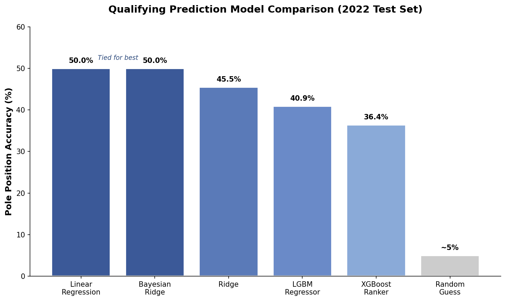
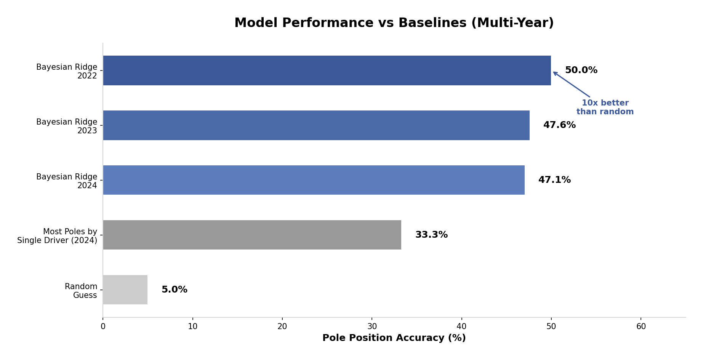
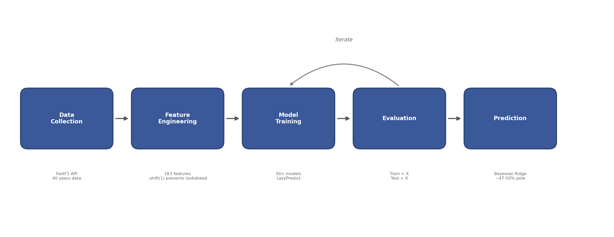

<p align="center">
  
</p>

<p align="center">
  <a href="https://www.python.org/"></a>
  <a href="https://scikit-learn.org/"></a>
  <a href="https://pandas.pydata.org/"></a>
  <a href="https://xgboost.readthedocs.io/"></a>
  <a href="https://lightgbm.readthedocs.io/"></a>
</p>

---

## Overview

A machine learning system that predicts Formula 1 qualifying results using only pre-race data. The final model achieves **50% pole position accuracy**—10x better than random chance—by analyzing 40 years of F1 history across 163 engineered features.

---

## The Challenge

Predicting F1 qualifying is difficult: 20 drivers compete on different tracks in varying conditions, with regulations changing every few years. 

**Key constraints:**
- Must predict *before* qualifying happens (lap time data from practice sessions only)
- Must handle regulation changes that shift team performance
- Results depend on many factors not available or predictable (like day-of driver performance)

---

## My Contributions

As **Model Engineer** on the F1ML2 team of Cornell Data Science Fall 2025, I oversaw the creation of the qualifying prediction pipeline—from data collection to final model.

### 1. Dataset Engineering

Built the complete training infrastructure from scratch:

| Dataset | Records | Features | Purpose |
|---------|---------|----------|---------|
| Production Dataset | 15,769 | 163 | 1983-2023 qualifying data |
| Modern Era | 2,000+ | 163 | 2018-2023 hybrid era |
| Train/Test Splits | Various | 163 | Temporal validation sets |

### 2. Feature Engineering

Engineered 163 features with rigorous data leakage prevention:

- Created circuit-specific, driver-specific, and team rolling statistics

### 3. Model Development & Selection

Trained 30+ models using LazyPredict, with Linear Regression and Bayesian Ridge tied for best performance:

<p align="center">
  
</p>

**Key finding:** Simpler models generalize better after regulation changes. Linear Regression and Bayesian Ridge both achieved 50% pole accuracy, outperforming complex ensemble methods like XGBoost and LightGBM.

### 4. Evaluation Pipeline

Built comprehensive testing with strict temporal validation:
- Train on all years before X, test on year X
- Ensures the model only sees past data when predicting future races
- Evaluated across 2022, 2023, and 2024 seasons for robustness

---

## Key Results

<p align="center">
  
</p>

### Multi-Year Performance (Bayesian Ridge)

| Test Year | Pole Accuracy | Correct/Total | Training Data |
|-----------|---------------|---------------|---------------|
| 2022 | **50.00%** | 11/22 | 1983-2021 |
| 2023 | **47.62%** | 10/21 | 1983-2022 + telemetry |
| 2024 | **47.06%** | 8/17 | 1983-2023 |

Bayesian Ridge maintained consistent ~47-50% accuracy across all test years, demonstrating robust generalization. Linear Regression achieved 50% on 2022 but failed on later years due to numerical instability.

---

## Technical Highlights

| Aspect | Details |
|--------|---------|
| Languages | Python 3.9+ |
| ML Libraries | scikit-learn, XGBoost, LightGBM |
| Data Processing | pandas, numpy |
| Data Source | FastF1 API (official F1 timing data) |
| Dataset Size | 15,769 records, 163 features, 40 years |
| Validation | Temporal train/test split (pre-X / X) |

---

## Architecture

<p align="center">
  
</p>

```
┌─────────────────────────────────────────────────────────────────────────┐
│                         DATA COLLECTION                                 │
│  FastF1 API → Practice Sessions, Qualifying Results, Race Results       │
│  40 years of F1 data (1983-2023) cached locally                         │
└────────────────────────────────┬────────────────────────────────────────┘
                                 │
                                 ▼
┌─────────────────────────────────────────────────────────────────────────┐
│                       FEATURE ENGINEERING                               │
│  163 features: Circuit (52) + Constructor (73) + Driver (10) + Era (5)  │
│  Rolling averages with .shift(1) to prevent lookahead.                  │
└────────────────────────────────┬────────────────────────────────────────┘
                                 │
                                 ▼
┌─────────────────────────────────────────────────────────────────────────┐
│                         MODEL TRAINING                                  │
│  30+ models benchmarked via LazyPredict (with/without scaling)          │
│  Linear Regression + Bayesian Ridge selected as top performers          │
└────────────────────────────────┬────────────────────────────────────────┘
                                 │
                                 ▼
┌─────────────────────────────────────────────────────────────────────────┐
│                    EVALUATION & ITERATION                               │
│  Temporal validation: Train on 1983-2021, test on 2022 (held-out)       │
│  Additional testing on 2023, 2024 seasons for multi-year validation     │
│  Metrics: Pole accuracy, Top 3 accuracy, Mean position error            │
└────────────────────────────────┬────────────────────────────────────────┘
                                 │
                                 ▼
┌─────────────────────────────────────────────────────────────────────────┐
│                          PREDICTION                                     │
│  Pre-qualifying predictions for pole position and grid order            │
│  Final model: Bayesian Ridge (no scaling required)                      │
└─────────────────────────────────────────────────────────────────────────┘
```

---

## Lessons Learned

### 1. Temporal Validation is Critical
Random train/test splits give misleading results for time-series prediction. A model trained on 2015-2023 data and tested on random samples from those years will appear to perform well, but fail on truly future data. Using a strict temporal split (train on pre-2022, test on 2022) revealed the true generalization performance.

### 2. Simpler Models Can Win
Linear Regression and Bayesian Ridge (50% pole accuracy) outperformed XGBoost (36%) and other ensemble methods. The 2022 F1 regulation changes introduced entirely new car designs, making complex models that memorized historical patterns less effective. Simpler models that learned fundamental relationships generalized better.

### 3. Feature Engineering > Model Complexity
The 163 engineered features—driver rolling averages, circuit-specific performance, constructor trends—drove predictive power more than model architecture. Spending time on feature engineering yielded better returns than hyperparameter tuning.

### 4. Scaling Affects Different Models Differently
Bayesian Ridge achieved 50% accuracy *without* scaling but dropped to 41% *with* StandardScaler. Tree-based models (XGBoost, LightGBM) were scale-invariant. This discovery came from systematically testing each model both ways—a reminder that preprocessing choices matter.

---

## Academic Context

**Organization:** Cornell Data Science

**My Role:** Model Engineer (most commits: 12/34)

**Semester:** Fall 2025

---

## About the Contributor

**Shawn Zou** · Cornell University

Machine learning enthusiast with interests in predictive modeling and data-driven insights. This project demonstrates proficiency in:
- End-to-end ML pipeline development
- Data preprocessing and feature engineering
- Model selection and optimization
- Technical communication and visualization

---

*Note: Source code is maintained in a private repository. This showcase highlights my contributions.*
